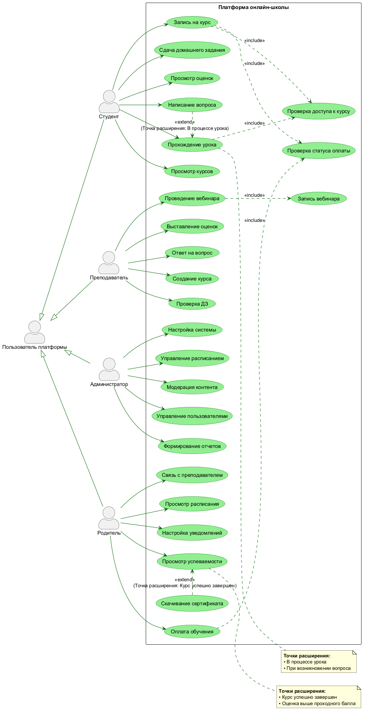
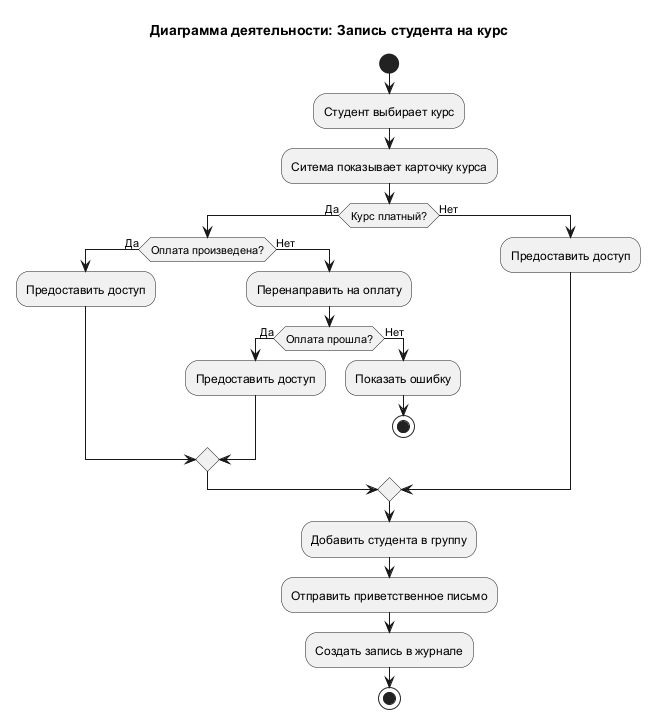

# UML Diagrams: Платформа онлайн-школы

## Описание
В данном репозитории располагаются графические модели из лабораторной работы №1 "Моделированию программной системы автоматизации онлайн-школы".
Система объединяет студентов, преподавателей, администраторов и родителей.

## Структура репозитория
* `use-case/` — Диаграмма вариантов использования (Use Case Diagram)
* `activity/` — Диаграммы деятельности (Activity Diagram)

## Актеры и их возможности
* **Студент**: Просмотр курсов, Прохождение урока, Сдача ДЗ, Просмотр оценок, Написание вопроса.
* **Преподаватель**: Создание курса, Проверка ДЗ, Проведение вебинара, Выставление оценок, Ответ на вопрос.
* **Администратор**: Управление пользователями, Формирование отчетов, Настройка системы, Управление расписанием, Модерация контента.
* **Родитель**: Оплата обучения, Просмотр успеваемости, Связь с преподавателем, Просмотр расписания, Настройка уведомлений.

## Диаграмма вариантов использования (Use Case)

## О диаграмме
* **Обобщение (Generalization)**: Все роли наследуются от базового актера «Пользователь платформы» (обозначается стрелкой с белым треугольником).
* **Include (`<<include>>`)**: Обязательные подпроцессы. Например, «Прохождение урока» всегда включает «Проверку доступа к курсу».
* **Extend (`<<extend>>`)**: Опциональные сценарии. Например, «Задать вопрос» расширяет «Прохождение урока», а «Скачать сертификат» расширяет «Просмотр успеваемости».

### 2. Диаграмма деятельности (Activity)

Описывает бизнес-логику процесса записи студента на курс, включая проверку оплаты и ветвления.

## Технологии
* PlantUML