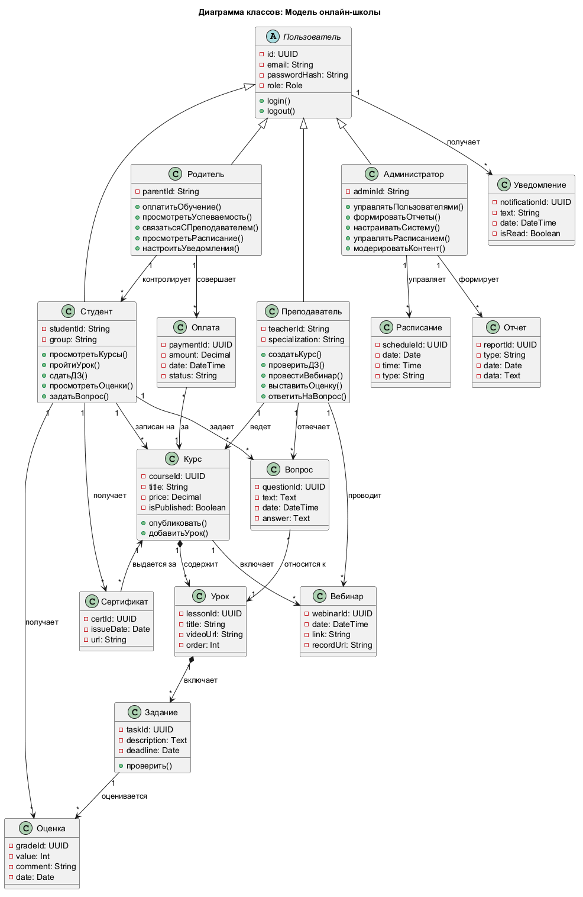

# UML Diagrams: Платформа онлайн-школы

## Описание
В данном репозитории располагаются графические модели из лабораторной работы №1 "Моделированию программной системы автоматизации онлайн-школы".
Система объединяет студентов, преподавателей, администраторов и родителей.

## Структура репозитория
* `use-case/` — Диаграмма вариантов использования (Use Case Diagram)
* `activity/` — Диаграмма деятельности (Activity Diagram)
* `class/` — Диаграмма классов (Class Diagram)

## Актеры и их возможности
* **Студент**: Просмотр курсов, Прохождение урока, Сдача ДЗ, Просмотр оценок, Написание вопроса.
* **Преподаватель**: Создание курса, Проверка ДЗ, Проведение вебинара, Выставление оценок, Ответ на вопрос.
* **Администратор**: Управление пользователями, Формирование отчетов, Настройка системы, Управление расписанием, Модерация контента.
* **Родитель**: Оплата обучения, Просмотр успеваемости, Связь с преподавателем, Просмотр расписания, Настройка уведомлений.

## 1. Диаграмма вариантов использования (Use Case)

## О диаграмме
* **Обобщение (Generalization)**: Все роли наследуются от базового актера «Пользователь платформы» (обозначается стрелкой с белым треугольником).
* **Include (`<<include>>`)**: Обязательные подпроцессы. Например, «Прохождение урока» всегда включает «Проверку доступа к курсу».
* **Extend (`<<extend>>`)**: Опциональные сценарии. Например, «Задать вопрос» расширяет «Прохождение урока», а «Скачать сертификат» расширяет «Просмотр успеваемости».

## 2. Диаграмма деятельности (Activity)

Описывает бизнес-логику процесса записи студента на курс, включая проверку оплаты и ветвления.

## 3. Диаграмма классов (Class)

Диаграмма описывает структуру системы онлайн-школы. В ее основе абстрактный класс Пользователь с общими атрибутами и методами аутентификации. От него наследуются четыре роли: Студент, Преподаватель, Администратор, Родитель. Это позволяет вынести общую логику в базовый класс и не дублировать её в каждом наследнике.

Учебный контент представлен классами Курс, Урок, Вебинар, Задание, Оценка. Курс агрегирует уроки и вебинары через композицию - урок не существует отдельно от курса. Задание привязано к уроку, оценка - к заданию и студенту одновременно. Вспомогательные сущности - Вопрос, Оплата, Уведомление, Расписание, Сертификат, Отчет.

## Технологии
* PlantUML